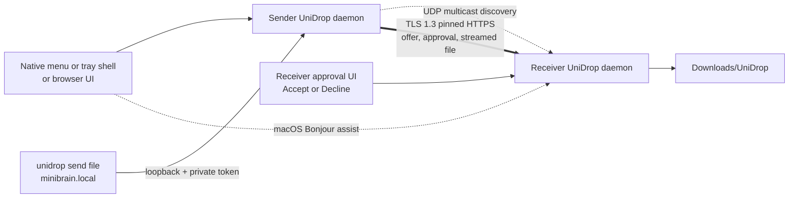

# UniDrop architecture

## Why local IP instead of cloning AirDrop's radio stack

AirDrop is not simply Bluetooth file transfer. Apple combines identity services, Bluetooth Low Energy discovery, and a proprietary peer-to-peer Wi-Fi link. Windows and Linux expose different Bluetooth, Wi-Fi Direct, firewall, notification, startup, and tray APIs; some capabilities also depend on hardware drivers and privileges.

The universal layer available on all three systems is IP networking. UniDrop therefore uses:

1. UDP multicast to advertise a small device record on each active IPv4 LAN interface.
2. A local browser panel for choosing peers and files.
3. TLS 1.3 over TCP for direct machine-to-machine streaming.
4. Persistent, periodically rechecked `host:port` entries as a deterministic fallback.

Bluetooth can later serve as a discovery or IP-bootstrap channel, but it should not be the bulk-data transport: platform APIs are fragmented and its throughput is substantially worse than Wi-Fi/Ethernet.

## Process model

Only the loopback interface can reach the control-panel API. Browser mutations require a private request header. CLI routes additionally require a random 256-bit token stored with user-only permissions. LAN peers can reach a deliberately small HTTPS API: identity inspection, pairing, authenticated offers, and accepted file receive.

## Pairing and trust

Each installation creates an ECDSA P-256 self-signed device certificate and random 128-bit device ID. The certificate's SHA-256 fingerprint is its transport identity.

On first pairing:

1. The receiver displays a random 64-bit one-time key.
2. The sender creates a random nonce and a 256-bit return token.
3. The sender sends an HMAC proof bound to the receiver fingerprint, both sender identity values, the nonce, and return token.
4. The receiver rate-limits attempts, verifies the proof, creates its own 256-bit token, persists mutual trust, and rotates the one-time key.
5. Both sides pin the other's certificate fingerprint for every later request.

This makes pairing mutual: after pairing once, either machine can send when it can discover the other. Reinstalling UniDrop creates a new certificate and requires pairing again.

## Offer and approval lifecycle

Every file has a separate, short-lived offer bound to its paired sender ID, sanitized filename, and exact byte count. The receiver chooses one persistent mode:

1. `ask` creates a pending card and sends no file bytes until **Accept** is pressed.
2. `trusted` immediately approves offers from paired devices.
3. `off` refuses new offers and declines anything still pending.

The sender polls the authenticated offer status for up to two minutes. Only an accepted, unexpired offer can be consumed, and it can enter the receiving state once. Changing the filename, sender, or content length causes the receiver to reject the upload.

## Friendly command bridge

`unidrop peers` gets the live discovery view from the loopback daemon. `unidrop send <files...> <device>` resolves a case-insensitive device ID, display name, friendly `name.local` alias, discovered address, or a manually reachable hostname. It then opens each local regular file inside the daemon and uses the same offer and streaming path as the browser.

The token in `control-token` prevents an unrelated web page from invoking filesystem paths through the bridge. The bridge accepts only loopback HTTP, absolute regular-file paths, and a correctly authenticated caller running as the same OS user.

## OS-specific shell layer

### macOS

- Install target: `~/Applications/UniDrop.app`
- Startup: `~/Library/LaunchAgents/com.unidrop.app.plist`
- Configuration: `~/Library/Application Support/UniDrop`
- Background behavior: `LSUIElement` hides the Dock icon while `NSStatusItem` stays visible
- Native shell: universal Swift/AppKit executable with a transient WebKit popover
- Discovery: cross-platform UDP multicast plus native `_unidrop._tcp` Bonjour publish/browse
- Local-network privacy: purpose string in the app and `AssociatedBundleIdentifiers` in the LaunchAgent
- User actions: compact popover, full panel, CLI, pause receiving, and Quit
- Receive notification: AppleScript notification

### Linux

- Install target: `~/.local/bin/unidrop`
- Startup: systemd user service where available, otherwise XDG autostart
- Application launcher: `~/.local/share/applications/unidrop.desktop`
- Configuration: `${XDG_CONFIG_HOME:-~/.config}/UniDrop`
- Native shell: pure-Go StatusNotifierItem plus DBusMenu companion, without GTK/Qt/Electron
- Dynamic states: nearby count, pending approvals, reconnecting, and attention icon
- User actions: Open, receive-mode selection, received files, and authenticated Quit
- Process model: separate user services keep the secure core independent from desktop tray availability
- Receive notification: `notify-send` when installed
- Fallback: application-menu/browser control panel when the desktop has no StatusNotifier host

### Windows

- Install target: `%LOCALAPPDATA%\UniDrop\unidrop.exe` plus `unidrop-tray.exe`
- Startup: per-user Startup shortcut
- Application launcher: per-user Start-menu shortcut
- Configuration: `%APPDATA%\UniDrop`
- Native shell: pure-Go Win32 hidden window plus `Shell_NotifyIconW`, without .NET, WebView2, or Electron
- Dynamic states: nearby count, pending approvals, reconnecting, attention icon, and request balloons
- User actions: Open, receive-mode selection, received files, and authenticated Quit
- Process model: the GUI-subsystem tray starts and monitors the console-capable secure core
- Recovery: stable single instance and automatic icon restoration after Windows Explorer restarts

## Protocol surface

The LAN server exposes these versioned routes:

- `GET /api/v1/info`: protocol/device metadata and certificate fingerprint
- `POST /api/v1/pair`: certificate-bound mutual pairing
- `POST /api/v1/offers`: authenticated filename/size offer
- `GET /api/v1/offers/{id}`: authenticated approval-status polling
- `POST /api/v1/files?name=...&offer=...`: authenticated, pre-approved raw file stream

Files are deliberately sent as raw request bodies rather than multipart forms. That keeps memory use bounded and makes the sender proxy each selected browser file directly to the receiver.

## Roadmap

1. Finder, Explorer, Dolphin, Nautilus, and Thunar **Send with UniDrop** entry points backed by the command bridge.
2. Optional compact Windows WebView2 panel with browser fallback.
3. Signed/notarized installers and an update manifest with binary checksums.
4. Optional QR pairing and a stronger PAKE-based short-code mode.
5. Folder transfer through a streamed, validated archive format.
6. Resumable chunked transfers and per-file BLAKE2/SHA-256 result verification.
7. Optional relay/WebRTC mode for different networks, clearly separated from LAN-only mode.

## Release trust path

`internal/version/VERSION`, `PROTOCOL`, and `MIN_COMPATIBLE_VERSION` are embedded
into every Go binary and read directly by installers, the website build, and
release tooling. `scripts/build-all.sh` cross-compiles every desktop architecture,
rebuilds both macOS menu architectures when Swift is available, and produces a
versioned manifest, SPDX 2.3 SBOM, and `SHA256SUMS` without third-party build
packages.

On macOS, `UNIDROP_BUILD_DEVELOPMENT_DMG=1` additionally creates a universal
`UniDrop.app`, signs every nested executable and the app with Hardened Runtime,
and builds a compressed DMG containing the app plus an Applications shortcut.
The default ad-hoc identity proves package structure in CI only. A public release
still requires the separately configured Developer ID identity, notarization,
stapling, and clean-machine Gatekeeper verification.

The trusted tag workflow is isolated from pull requests. It requires an annotated
immutable version tag and protected Ed25519 signing key, signs the exact manifest
bytes, requests short-lived GitHub OIDC/Sigstore provenance and SBOM attestations,
then publishes a new release without replacing prior assets. OS publisher signing
and notarization are separate mandatory layers; a manifest signature does not
make an unsigned macOS or Windows package trustworthy to the operating system.

The update acceptance and key-rotation contract is documented in
`docs/UPDATE_SECURITY.md`. Automatic update code remains disabled until all
negative tests and clean-machine recovery checks in that document pass.
