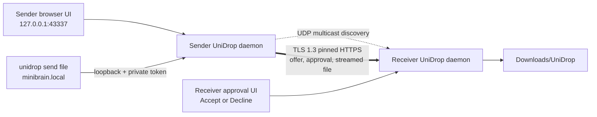

# UniDrop architecture

## Why local IP instead of cloning AirDrop's radio stack

AirDrop is not simply Bluetooth file transfer. Apple combines identity services, Bluetooth Low Energy discovery, and a proprietary peer-to-peer Wi-Fi link. Windows and Linux expose different Bluetooth, Wi-Fi Direct, firewall, notification, startup, and tray APIs; some capabilities also depend on hardware drivers and privileges.

The universal layer available on all three systems is IP networking. UniDrop therefore uses:

1. UDP multicast to advertise a small device record on the local network.
2. A local browser panel for choosing peers and files.
3. TLS 1.3 over TCP for direct machine-to-machine streaming.
4. Manual `host:port` entry as a deterministic fallback.

Bluetooth can later serve as a discovery or IP-bootstrap channel, but it should not be the bulk-data transport: platform APIs are fragmented and its throughput is substantially worse than Wi-Fi/Ethernet.

## Process model

Only the loopback interface can reach the control-panel API. Browser mutations require a private request header. CLI routes additionally require a random 256-bit token stored with user-only permissions. LAN peers can reach a deliberately small HTTPS API: identity inspection, pairing, authenticated offers, and accepted file receive.

## Pairing and trust

Each installation creates an ECDSA P-256 self-signed device certificate and random 128-bit device ID. The certificate's SHA-256 fingerprint is its transport identity.

On first pairing:

1. The receiver displays a random 64-bit one-time key.
2. The sender creates a random nonce and a 256-bit return token.
3. The sender sends an HMAC proof bound to the receiver fingerprint, both sender identity values, the nonce, and return token.
4. The receiver rate-limits attempts, verifies the proof, creates its own 256-bit token, persists mutual trust, and rotates the one-time key.
5. Both sides pin the other's certificate fingerprint for every later request.

This makes pairing mutual: after pairing once, either machine can send when it can discover the other. Reinstalling UniDrop creates a new certificate and requires pairing again.

## Offer and approval lifecycle

Every file has a separate, short-lived offer bound to its paired sender ID, sanitized filename, and exact byte count. The receiver chooses one persistent mode:

1. `ask` creates a pending card and sends no file bytes until **Accept** is pressed.
2. `trusted` immediately approves offers from paired devices.
3. `off` refuses new offers and declines anything still pending.

The sender polls the authenticated offer status for up to two minutes. Only an accepted, unexpired offer can be consumed, and it can enter the receiving state once. Changing the filename, sender, or content length causes the receiver to reject the upload.

## Friendly command bridge

`unidrop peers` gets the live discovery view from the loopback daemon. `unidrop send <files...> <device>` resolves a case-insensitive device ID, display name, friendly `name.local` alias, discovered address, or a manually reachable hostname. It then opens each local regular file inside the daemon and uses the same offer and streaming path as the browser.

The token in `control-token` prevents an unrelated web page from invoking filesystem paths through the bridge. The bridge accepts only loopback HTTP, absolute regular-file paths, and a correctly authenticated caller running as the same OS user.

## OS-specific shell layer

### macOS

- Install target: `~/Applications/UniDrop.app`
- Startup: `~/Library/LaunchAgents/com.unidrop.app.plist`
- Configuration: `~/Library/Application Support/UniDrop`
- Background behavior: `LSUIElement` hides the Dock icon
- User actions: the app or CLI opens the loopback control panel with `open`
- Receive notification: AppleScript notification
- Future menu bar: a small Swift/AppKit adapter using `NSStatusItem`

### Linux

- Install target: `~/.local/bin/unidrop`
- Startup: systemd user service where available, otherwise XDG autostart
- Application launcher: `~/.local/share/applications/unidrop.desktop`
- Configuration: `${XDG_CONFIG_HOME:-~/.config}/UniDrop`
- User actions: `xdg-open` opens the control panel and receive folder
- Receive notification: `notify-send` when installed
- Future tray: StatusNotifierItem/AppIndicator adapter, with a browser fallback for desktops that removed tray support

### Windows

- Install target: `%LOCALAPPDATA%\UniDrop\unidrop.exe`
- Startup: per-user Startup shortcut
- Application launcher: per-user Start-menu shortcut
- Configuration: `%APPDATA%\UniDrop`
- User actions: Windows URL/file protocol handler opens the control panel and receive folder
- Future tray: a small native adapter built on `Shell_NotifyIcon`

## Protocol surface

The LAN server exposes these versioned routes:

- `GET /api/v1/info`: protocol/device metadata and certificate fingerprint
- `POST /api/v1/pair`: certificate-bound mutual pairing
- `POST /api/v1/offers`: authenticated filename/size offer
- `GET /api/v1/offers/{id}`: authenticated approval-status polling
- `POST /api/v1/files?name=...&offer=...`: authenticated, pre-approved raw file stream

Files are deliberately sent as raw request bodies rather than multipart forms. That keeps memory use bounded and makes the sender proxy each selected browser file directly to the receiver.

## Roadmap

1. Native tray/menu-bar adapters with **Open**, **Receive mode**, and **Quit**.
2. Finder, Explorer, Dolphin, Nautilus, and Thunar **Send with UniDrop** entry points backed by the command bridge.
3. Signed/notarized installers and an update manifest with binary checksums.
4. Optional QR pairing and a stronger PAKE-based short-code mode.
5. Folder transfer through a streamed, validated archive format.
6. Resumable chunked transfers and per-file BLAKE2/SHA-256 result verification.
7. Optional relay/WebRTC mode for different networks, clearly separated from LAN-only mode.
